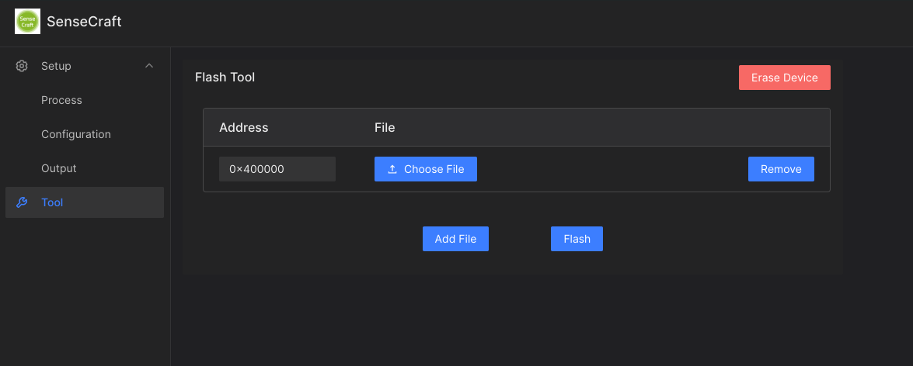

# Deployment Example

SSCMA is an open-source project that provides a No-Code visual model deployment tool and a CPP-based SDK, enabling users to easily deploy models to different platforms without writing complex code.

Currently supported platforms include:

| Device | SenseCraft-Web-Toolkit | SSCMA-Micro SDK |
| :--- | :--- | :--- |
| [Xiao ESP32S3](https://www.seeedstudio.com/XIAO-ESP32S3-Sense-p-5639.html) | ✅ | ✅ |
| [Grove Vision AI](https://www.seeedstudio.com/Grove-Vision-AI-Module-p-5457.html) | ✅ | ✅ |

## SenseCraft-Web-Toolkit

SenseCraft-Web-Toolkit is a visual model deployment tool provided by SSCMA. With this tool, users can deploy models to various platforms through simple operations without the need for any coding skills.

The main features of [SenseCraft-Web-Toolkit](https://seeed-studio.github.io/SenseCraft-Web-Toolkit/) include:

- A visual operation interface without the need for coding skills
- Rapid deployment of models to different platforms
- Support for TFLite format models

### Deploying Public Models

Step 1. Open the SenseCraft-Web-Toolkit website

Step 2. Connect the device to your computer

Use a data transfer cable to connect your device to your computer.

Step 3. Select and connect your device

After entering the homepage of SenseCraft-Web-Toolkit, we need to connect the device first. Please click the connect button.

 

Then, a browser window will pop up. We need to select the correct XIAO port here. For Windows systems, the port usually starts with COM, while for macOS systems, the port usually starts with /dev/tty and includes USB JTAG. If you are not sure about the correct port, please refresh this page after connecting the device, then click the connect button again, and you will see new ports appear in the drop-down list.

 

Step 4. Select your model

Once the connect button turns into a red disconnect button, we can select the model from the "Available AI Models" list. Here, I chose face recognition as a demonstration. After selection, click the send button and wait for a few seconds.

 

Step 5. Deploy your model

 

Finally, we arrive at the preview section, click the stop button in the upper right corner once, then click the call button, if everything goes well, you can see the real-time screen effect.

 

### Deploying Self- trained Models

Step 1. Open the SenseCraft-Web-Toolkit website

Step 2. Connect the device to your computer

Use a data transfer cable to connect your device to your computer.

Step 3. Select and connect your device

After entering the homepage of SenseCraft-Web-Toolkit, we need to connect the device first. Please click the connect button.

 

Then, a browser window will pop up. We need to select the correct XIAO port here. For Windows systems, the port usually starts with COM, while for macOS systems, the port usually starts with /dev/tty and includes USB JTAG. If you are not sure about the correct port, please refresh this page after connecting the device, then click the connect button again, and you will see new ports appear in the drop-down list.

 

Step 4. Upload your model

First, click the Tool button on the left, then click the Upload button on the right, select your model file, set the Address to `0x400000`, and finally click the Flash button. Keep the device connected and wait for the burning process to complete.

## SSCMA-Micro SDK

SSCMA also provides a CPP-based SDK called SSCMA-Micro, which allows users to deploy models into their own projects. By integrating SSCMA-Micro, users can easily use deployed models in their applications.

The features of the [SSCMA-Micro](https://github.com/Seeed-Studio/SSCMA-Micro) SDK include:

- Written in CPP, suitable for various embedded systems and platforms
- Provides simple and powerful APIs for users to call and infer models
- Support for TFLite format models
